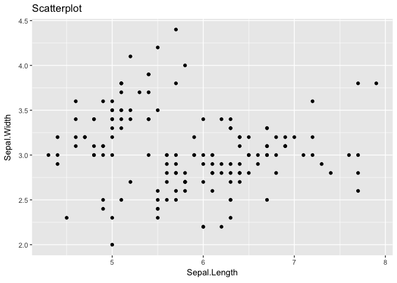
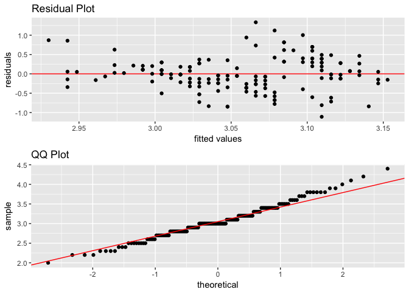

statr
================

[](https://travis-ci.org/MGallow/statr)
[](https://cran.r-project.org/package=statr)

## Overview

`statr` is a personal R package that I have created for
organizational/convenience purposes. This project is purely
experimental\! A (possibly incomplete) list of functions contained in
the package can be found below:

  - `tidy()` tidy’s R package code and updates documentation
  - `timeit()` prints the computation time of a function
  - `scatter()` creates a scatterplot using ggplot
  - `diagnostic()` creates diagnostic plots using ggplot (residual and
    QQ)
  - `dsearch()` is a dichotomous search algorithm for minimizing a
    univariate function
  - `bsearch()` is a bi-section search algorithm for minimizing a
    univariate function

See [vignette](https://mgallow.github.io/statr/) or
[manual](https://github.com/MGallow/statr/blob/master/statr.pdf).

## Installation

The easiest way to install is from the development version from Github:

``` r
# install.packages("devtools")
devtools::install_github("MGallow/statr")
```

If there are any issues/bugs, please let me know:
[github](https://github.com/MGallow/statr/issues). You can also contact
me via my [website](https://mgallow.github.io/). Contributions are
welcome\!

## Usage

``` r
library(statr)

#we will use the iris data set
X = dplyr::select(iris, -c(Species, Sepal.Length))
y = dplyr::select(iris, Sepal.Length)
y_class = ifelse(dplyr::select(iris, Species) == "setosa", 1, 0)

#plot Sepal.Length v Sepal.Width
iris %>% scatter(Sepal.Length, Sepal.Width)
```

<!-- -->

``` r
#plot diagnostic plots
iris %>% diagnostic(Sepal.Length, Sepal.Width)
```

<!-- -->
