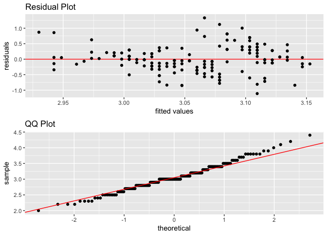

statr
================

Alternatively, check out the [vignette](https://htmlpreview.github.io/?https://github.com/MGallow/statr/blob/master/Vignette.html) or [manual](https://github.com/MGallow/statr/blob/master/statr.pdf).

Overview
--------

`statr` is a personal R package that I have created for organizational/convenience purposes. A (possibly incomplete) list of functions contained in the package can be found below:

-   `tidy()` tidy's R package code and updates documentation
-   `timeit()` prints the computation time of a function
-   `scatter()` creates a scatterplot using ggplot
-   `diagnostic()` creates diagnostic plots using ggplot (residual and QQ)
-   `dsearch()` is a dichotomous search algorithm for minimizing a univariate function
-   `bsearch()` is a bi-section search algorithm for minimizing a univariate function
-   `linearr()` computes the linear regression coefficient estimates (ridge regularization and weights optional)
-   `predict_linearr()` generates predictions and loss metric for linear regression
-   `logisticr()` computes the coefficient estimates for logistic regression (ridge and bridge regularization optional)
-   `predict_logisticr()` generates predictions and loss metrics for logistic

Installation
------------

The easiest way to install is from the development version from Github:

``` r
# install.packages("devtools")
devtools::install_github("MGallow/statr")
```

If there are any issues/bugs, please let me know: [github](https://github.com/MGallow/statr/issues). You can also contact me via my [website](http://users.stat.umn.edu/~gall0441/). Contributions are welcome!

Usage
-----

``` r
library(statr)

#we will use the iris data set
X = dplyr::select(iris, -c(Species, Sepal.Length))
y = dplyr::select(iris, Sepal.Length)
y_class = ifelse(dplyr::select(iris, Species) == "setosa", 1, 0)

#plot Sepal.Length v Sepal.Width
scatter(iris, Sepal.Length, Sepal.Width)
```


``` r
#plot diagnostic plots
diagnostic(iris, Sepal.Length, Sepal.Width)
```



``` r
#ridge regression (use CV for optimal lambda)
linearr(X, y, penalty = "ridge")
```

    ## $parameters
    ##      lam alpha
    ## [1,] 0.2   NaN
    ## 
    ## $coefficients
    ##                 [,1]
    ## intercept  1.8991336
    ##            0.6417452
    ##            0.6957344
    ##           -0.5272921
    ## 
    ## $MSE
    ## [1] 0.09634343
    ## 
    ## $gradient
    ##                    [,1]
    ## intercept -2.273737e-13
    ##           -5.109246e-13
    ##           -1.755235e-12
    ##           -3.128608e-13

``` r
#ridge logistic regression (IRLS) (use CV for optimal lambda)
logisticr(X, y_class, penalty = "ridge")
```

    ## $parameters
    ##      lam alpha
    ## [1,]   0   NaN
    ## 
    ## $coefficients
    ##                 [,1]
    ## intercept   7.885352
    ##             8.894847
    ##            -7.548629
    ##           -18.604247
    ## 
    ## $MSE
    ## [1] 8.0815e-14
    ## 
    ## $log.loss
    ## [1] 6.929591e-06
    ## 
    ## $misclassification
    ## [1] 0
    ## 
    ## $total.iterations
    ## [1] 18
    ## 
    ## $gradient
    ##                   [,1]
    ## intercept 1.240583e-06
    ##           3.160471e-06
    ##           9.143271e-06
    ##           3.372886e-06

``` r
#ridge logistic regression (MM)
logisticr(X, y_class, lam = 0.1, penalty = "ridge", method = "MM")
```

    ## $parameters
    ##      lam alpha
    ## [1,] 0.1   NaN
    ## 
    ## $coefficients
    ##                [,1]
    ## intercept  6.276226
    ##            1.540818
    ##           -3.641769
    ##           -1.630502
    ## 
    ## $MSE
    ## [1] 5.134801e-05
    ## 
    ## $log.loss
    ## [1] 0.3956563
    ## 
    ## $misclassification
    ## [1] 0
    ## 
    ## $total.iterations
    ## [1] 5459
    ## 
    ## $gradient
    ##                   [,1]
    ## intercept 1.831808e-06
    ##           5.390560e-06
    ##           9.993386e-06
    ##           3.516598e-06

``` r
#bridge logistic regression (MM)
fit = logisticr(X, y_class, lam = 0.1, alpha = 1.2, penalty = "bridge")
```

    ## [1] "using MM algorithm..."

``` r
fit
```

    ## $parameters
    ##      lam alpha
    ## [1,] 0.1   1.2
    ## 
    ## $coefficients
    ##                 [,1]
    ## intercept 13.0803079
    ##            0.6170122
    ##           -5.7168400
    ##           -0.2300421
    ## 
    ## $MSE
    ## [1] 2.749702e-05
    ## 
    ## $log.loss
    ## [1] 0.1878654
    ## 
    ## $misclassification
    ## [1] 0
    ## 
    ## $total.iterations
    ## [1] 26021
    ## 
    ## $gradient
    ##                   [,1]
    ## intercept 1.790042e-06
    ##           5.268013e-06
    ##           9.997899e-06
    ##           3.518574e-06

``` r
#time bridge logistic regression
timeit(logisticr(X, y_class, lam = 0.1, alpha = 1.2, penalty = "bridge"))
```

    ## [1] "using MM algorithm..."

    ##    user  system elapsed 
    ##   0.243   0.001   0.244

``` r
#predict using bridge logistic regression estimates
predict_logisticr(fit, X[1:3,], y_class[1:3])
```

    ## $fitted.values
    ##           [,1]
    ## [1,] 0.9992467
    ## [2,] 0.9989747
    ## [3,] 0.9994881
    ## 
    ## $class
    ##      [,1]
    ## [1,]    1
    ## [2,]    1
    ## [3,]    1
    ## 
    ## $MSE
    ## [1] 6.269174e-07
    ## 
    ## $log.loss
    ## [1] 0.002291457
    ## 
    ## $misclassification
    ## [1] 0
